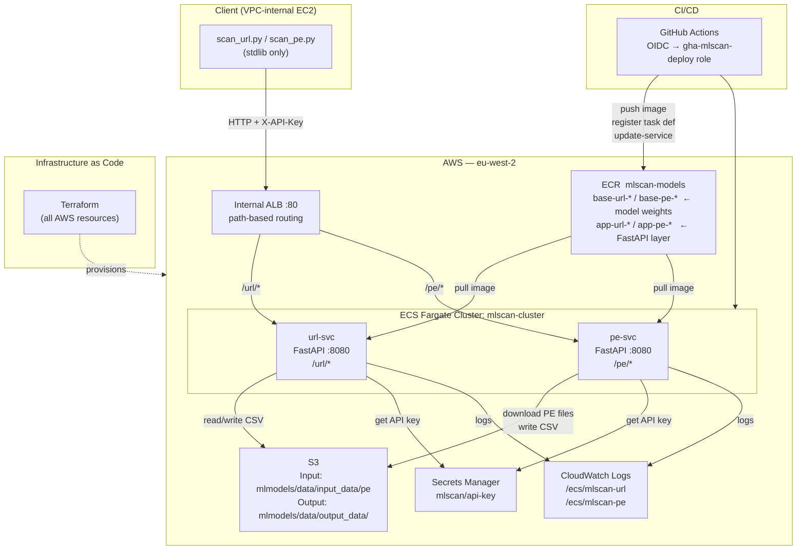
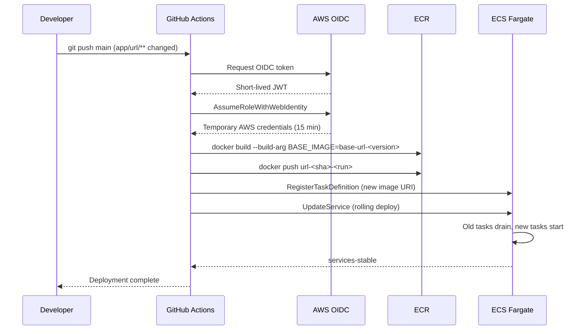
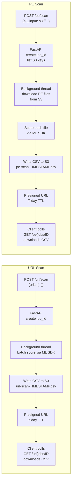

# Production MLOps Platform for URL & PE Malware Classification

A production-grade MLOps platform serving two ML classification models on AWS — one for URL threat detection, one for PE (Windows executable) malware detection. Both services run as persistent async REST APIs on AWS ECS Fargate, sit behind an internal ALB with path-based routing, and are continuously deployed via GitHub Actions using keyless OIDC authentication. All infrastructure is managed as code with Terraform.

Every scored item passes through a **three-tier decision guardrail** (Quarantine / Security Alert / Manual Review) based on model confidence, with structured audit events streamed to CloudWatch Logs. Application and model performance metrics — score distribution, malicious rate, scan latency, job queue depth — are emitted to **CloudWatch** in real time, surfaced on an operations dashboard, and backed by eight alarms covering both model drift and guardrail events.

---

## Skills Demonstrated

| Skill Area | Technologies |
|------------|-------------|
| **MLOps & Model Serving** | FastAPI async REST APIs, lazy model loading (double-checked locking), batch scoring |
| **Model Monitoring** | CloudWatch custom metrics (score distribution, malicious %, latency, queue depth); drift alarms; operations dashboard; decision guardrails with CloudWatch Logs audit trail |
| **Infrastructure as Code** | Terraform — ECS, ALB, ECR, IAM, Secrets Manager, CloudWatch alarms + dashboard, SNS; S3 remote state |
| **Containerisation** | Multi-layer Docker builds; pre-built ML model base image + thin app layer; WORKDIR/PYTHONPATH isolation |
| **Cloud — AWS** | ECS Fargate (serverless), ALB path-based routing, ECR (immutable tags), S3, Secrets Manager, CloudWatch |
| **CI/CD — Keyless** | GitHub Actions + AWS OIDC federation; no long-lived secrets; automated rolling ECS deployment |
| **Security** | IAM least-privilege, Secrets Manager API key rotation, S3 presigned URLs, internal-only ALB |
| **Async Job Pattern** | POST → job_id → poll → presigned S3 CSV download; handles batch jobs that exceed HTTP timeout |
| **Python** | pydantic v1/v2 compatibility, thread-safe singleton, batch processing, stdlib-only client |

---

## System Architecture



---

## CI/CD Pipeline



---

## Data Flow



---

## Repository Structure

```
.
├── app/
│   ├── common/
│   │   ├── auth.py          # API key auth via Secrets Manager (lru_cache)
│   │   ├── guardrails.py    # Decision guardrails: classify score → verdict, log, quarantine
│   │   ├── jobs.py          # Thread-safe in-memory async job store
│   │   ├── metrics.py       # CloudWatch metrics emitter (async, fire-and-forget)
│   │   └── s3util.py        # S3 helpers: list, download, upload, presign
│   ├── url/
│   │   ├── Dockerfile       # FROM ml-model-base + FastAPI layer
│   │   ├── main.py          # POST /url/scan, GET /url/jobs/{id}
│   │   ├── model_adapter.py # ML SDK wrapper (stub + real, lazy singleton)
│   │   └── requirements.txt # pydantic v2
│   └── pe/
│       ├── Dockerfile       # FROM ml-model-base + FastAPI layer
│       ├── main.py          # POST /pe/scan, GET /pe/jobs/{id}
│       ├── model_adapter.py # ML SDK wrapper (pydantic v1 compatible)
│       └── requirements.txt # pydantic v1 (SDK constraint)
├── client/
│   ├── scanclient.py        # HTTP client with polling — stdlib only
│   ├── scan_url.py          # CLI: submit URLs, poll, download CSV
│   ├── scan_pe.py           # CLI: submit S3 PE prefix, poll, download CSV
│   └── test_urls.txt        # Sample URLs for testing
├── terraform/               # All AWS infrastructure as code
│   ├── main.tf              # Provider + S3 backend
│   ├── variables.tf         # Region, bucket, subnets, GitHub repo
│   ├── data.tf              # References: VPC, ecsTaskExecutionRole, OIDC provider
│   ├── iam.tf               # mlscan-task-role + gha-mlscan-deploy
│   ├── ecr.tf               # ECR repo (immutable tags)
│   ├── secrets.tf           # Secrets Manager: mlscan/api-key
│   ├── security_groups.tf   # ALB SG + ECS task SG
│   ├── alb.tf               # ALB + target groups + listener + path rules
│   ├── ecs.tf               # Cluster + task definitions + services + log groups
│   ├── cloudwatch.tf        # SNS topic, 4 alarms, operations dashboard
│   └── outputs.tf           # ALB DNS, ECR URI, role ARNs, dashboard URL
├── .github/workflows/
│   ├── deploy-url.yml       # OIDC → build → push → rolling deploy (url-svc)
│   └── deploy-pe.yml        # OIDC → build → push → rolling deploy (pe-svc)
├── scripts/
│   ├── push_base.sh         # Push new ML model base image to ECR
│   └── update_image.sh      # Manual build + deploy (without CI)
└── docs/
    ├── architecture.md
    ├── design.md
    └── dataflow.md
```

---

## Monitoring

Each service emits custom metrics to CloudWatch namespace **`MLScan`** (dimension `Service=url|pe`) via an async fire-and-forget emitter — CloudWatch API latency never delays scan responses.

| Metric | Unit | Description |
|--------|------|-------------|
| `Score` | 0–100 | Maliciousness score per item |
| `ScanLatencyMs` | ms | Time to score one item via ML SDK |
| `MaliciousPct` | % | Fraction of items flagged in a job |
| `MeanScore` | 0–100 | Mean score across a job |
| `JobDuration` | s | Wall-clock time for a completed job |
| `JobItemsProcessed` | count | Items scored per job |
| `JobError` | count | 1 when a background job fails |
| `JobQueueDepth` | count | Active jobs at scan request time |

**Dashboard** `mlscan-overview` — 4 rows, 12 widgets covering both services:

```
Row 1 (URL): Score Distribution │ Malicious % │ Scan Latency │ Queue Depth + Job Duration
Row 2 (PE):  Score Distribution │ Malicious % │ Scan Latency │ Queue Depth + Job Duration
Row 3:       Job Errors (URL + PE combined) │ Alarm status panel (8 alarms)
Row 4:       URL Guardrail Verdict Counts   │ PE Guardrail Verdict Counts
```

**Alarms** → SNS topic `mlscan-alerts` (subscribe your email via `terraform output alerts_sns_arn`):

| Alarm | Trigger | Interpretation |
|-------|---------|----------------|
| `mlscan-malicious-spike-url` | URL MaliciousPct > 70% | Model drift or real threat spike |
| `mlscan-malicious-spike-pe` | PE MaliciousPct > 70% | Model drift or real threat spike |
| `mlscan-job-error-url` | URL JobError ≥ 1 in 5 min | Scan job failure |
| `mlscan-job-error-pe` | PE JobError ≥ 1 in 5 min | Scan job failure |
| `mlscan-guardrail-quarantine-url` | Any URL quarantine event | High-confidence malicious URL detected |
| `mlscan-guardrail-quarantine-pe` | Any PE quarantine event | High-confidence malicious PE file quarantined |
| `mlscan-guardrail-security-alert-url` | ≥ 5 URL security alerts in 5 min | Surge of medium-confidence malicious URLs |
| `mlscan-guardrail-security-alert-pe` | ≥ 5 PE security alerts in 5 min | Surge of medium-confidence malicious PE files |

---

## Decision Guardrails

Each scored item is routed through a three-tier guardrail based on its maliciousness **probability** (= score ÷ 100), minimising false-positive operational impact — automatic action is only taken at high confidence.

| Probability | Score range | Verdict | Action |
|-------------|-------------|---------|--------|
| ≥ 0.95 | 95–100 | **QUARANTINE** | PE file copied to `s3://<bucket>/quarantine/pe/` and tagged `status=quarantined`; structured log at CRITICAL level; CloudWatch alarm fires immediately |
| 0.75–0.95 | 75–94 | **ALERT** | Security alert log at WARNING level; CloudWatch metric incremented; alarm fires if ≥ 5 in 5 min; no file action |
| 0.30–0.75 | 30–74 | **MANUAL_REVIEW** | Flagged for human review; log at INFO level; CloudWatch metric incremented |
| < 0.30 | 0–29 | **ALLOW** | Clean; no action |

The `verdict` column is appended to every output CSV row (URL and PE).

**Structured log format** (all guardrail events appear in `/ecs/mlscan-url` and `/ecs/mlscan-pe` CloudWatch Logs groups):

```json
{"event":"GUARDRAIL","timestamp":"2026-07-13T04:00:00Z","service":"pe","verdict":"QUARANTINE","score":97,"probability":0.97,"item_id":"suspicious.exe"}
```

**Guardrail alarms** (→ SNS topic `mlscan-alerts`):

| Alarm | Condition |
|-------|-----------|
| `mlscan-guardrail-quarantine-url` | Any URL quarantine event |
| `mlscan-guardrail-quarantine-pe` | Any PE quarantine event |
| `mlscan-guardrail-security-alert-url` | ≥ 5 URL security alerts in 5 min |
| `mlscan-guardrail-security-alert-pe` | ≥ 5 PE security alerts in 5 min |

**Implementation:** `app/common/guardrails.py` — `classify(score)` maps score → verdict; `apply(...)` logs, emits metric, and for PE QUARANTINE calls `s3.copy_object` to the quarantine prefix.

---

## How It Works

### Scoring

Both models return a 0–100 integer maliciousness score.

| Score | Verdict |
|-------|---------|
| 0–29 | Clean |
| ≥ 30 | Malicious |

### Async Job Pattern

Batch scanning hundreds of PE files can take minutes — far beyond the ALB's 60-second HTTP timeout. The services use a fire-and-poll pattern:

```
1. POST /url/scan  →  {"job_id": "abc123", "status": "running", "total": 500}
2. GET  /url/jobs/abc123  →  {"status": "running", "processed": 120, "total": 500}
3. GET  /url/jobs/abc123  →  {"status": "done", "output_s3": "s3://...", "download_url": "https://..."}
4. HTTP GET download_url  →  results.csv  (presigned, 7-day TTL)
```

### Model Loading

The ML SDK is loaded once on the first request using a double-checked locking singleton. This avoids re-loading multi-GB model weights on each call while remaining thread-safe under FastAPI's concurrent request handling.

---

## Getting Started

### Prerequisites

- AWS account (eu-west-2 or your chosen region)
- Pre-built ML model base Docker images (URL and PE)
- Terraform >= 1.7
- GitHub repository with OIDC trust configured

### 1. Provision infrastructure with Terraform

```bash
cd terraform/

# Edit variables.tf with your VPC ID, subnet IDs, S3 bucket, GitHub repo
terraform init
terraform apply
```

Terraform creates: IAM roles, ECR repo, Secrets Manager secret, security groups, ALB + routing rules, ECS cluster + task definitions + services, CloudWatch log groups.

Set the API key:
```bash
terraform apply -var='api_key_secret_value=<your-key>'
```

### 2. Push ML model base images to ECR

```bash
ECR_REPO=<YOUR_ACCOUNT_ID>.dkr.ecr.eu-west-2.amazonaws.com/mlscan-models
AWS_REGION=eu-west-2

./scripts/push_base.sh url ml-url-model:20250301
./scripts/push_base.sh pe ml-pe-model:20240318
```

### 3. Deploy via GitHub Actions

Update `BASE_TAG` in `.github/workflows/deploy-url.yml` and `.github/workflows/deploy-pe.yml` with your base image tags, then push to `main`. The workflow:

1. Gets temporary AWS credentials via OIDC (no secrets stored in GitHub)
2. Builds the app image `FROM <ECR base>` + FastAPI code
3. Pushes with unique tag `url-<sha>-<run_number>`
4. Registers a new ECS task definition revision
5. Calls `update-service --force-new-deployment` → rolling update

Or deploy manually without CI:
```bash
./scripts/update_image.sh url base-url-20250301
./scripts/update_image.sh pe base-pe-20240318
```

### 4. Run a scan

```bash
export SCAN_API_KEY='<key from Secrets Manager>'
ALB=http://<YOUR_ALB_DNS>

# URL scan — local text file
python3 client/scan_url.py --api-url $ALB --file client/test_urls.txt --out results.csv

# PE scan — S3 prefix
python3 client/scan_pe.py --api-url $ALB \
    --s3-input s3://<YOUR_S3_BUCKET>/mlmodels/data/input_data/pe --out pe_results.csv
```

---

## Configuration Reference

| Env Var | Default | Description |
|---------|---------|-------------|
| `SAI_API_CONFIG_PATH` | `/usr/src/app/config.ini` | ML SDK config path; points to the model weight file containing trained feature weights |
| `SYSTEM` | `internal` | Required by the model creator for standard 0–100 integer scoring |
| `AWS_REGION` | `eu-west-2` | AWS region for S3 and Secrets Manager |
| `OUTPUT_PREFIX` | `s3://<bucket>/mlmodels/data/output_data/<kind>` | S3 prefix for result CSVs |
| `API_KEY_SECRET_NAME` | — | Secrets Manager secret name for API key auth |
| `THRESHOLD` | `30` | Score ≥ threshold → malicious flag in output CSV |

---

## License

MIT
