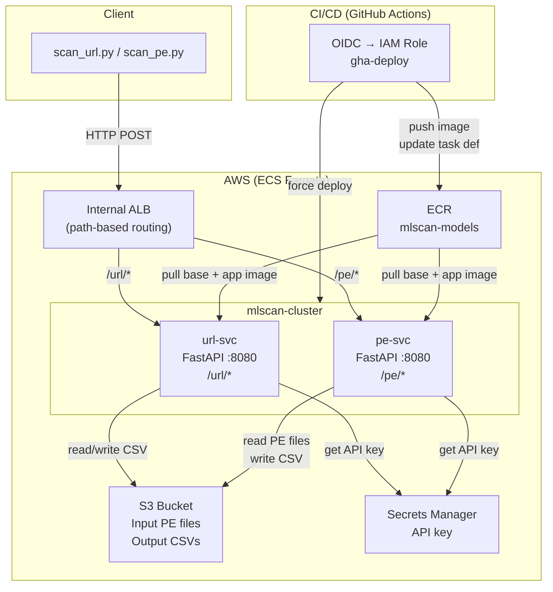
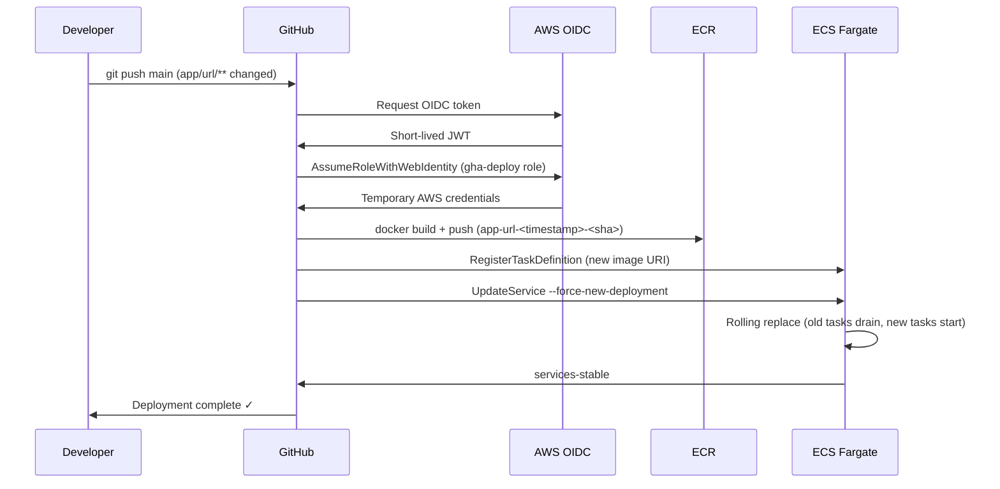
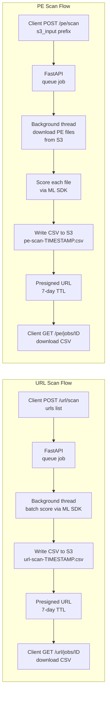

# Production MLOps: URL & PE File Classification

A production-grade MLOps system that serves two ML classification models on AWS — one for URL threat detection and one for PE (Windows executable) malware detection. Both services expose async REST APIs, run in AWS ECS Fargate, and are continuously deployed via GitHub Actions using keyless OIDC authentication.

---

## Key Skills Demonstrated

| Area | Technology |
|------|-----------|
| **MLOps / Model Serving** | FastAPI async REST APIs, lazy model loading, stub/real mode switching |
| **Containerisation** | Multi-stage Docker builds, vendor SDK base images, WORKDIR/PYTHONPATH isolation |
| **Cloud Infrastructure** | AWS ECS Fargate (serverless), ALB path-based routing, ECR image registry |
| **CI/CD (Keyless)** | GitHub Actions + AWS OIDC (no long-lived secrets), automated ECS rolling deployment |
| **Security** | IAM least-privilege, Secrets Manager for API keys, S3 presigned download URLs |
| **Async Job Pattern** | POST → job_id → poll → presigned S3 CSV download |
| **Python** | pydantic v1/v2 compatibility, thread-safe singleton, batch processing |

---

## System Architecture



---

## CI/CD Pipeline



---

## Data Flow



---

## Repository Structure

```
.
├── app/
│   ├── common/
│   │   ├── auth.py          # API key auth via Secrets Manager
│   │   ├── jobs.py          # In-memory async job store
│   │   └── s3util.py        # S3 helpers (list, download, upload, presign)
│   ├── url/
│   │   ├── Dockerfile       # Builds on vendor URL model base image
│   │   ├── main.py          # FastAPI: POST /url/scan, GET /url/jobs/{id}
│   │   ├── model_adapter.py # Vendor ML SDK wrapper (stub + real modes)
│   │   └── requirements.txt
│   └── pe/
│       ├── Dockerfile       # Builds on vendor PE model base image
│       ├── main.py          # FastAPI: POST /pe/scan, GET /pe/jobs/{id}
│       ├── model_adapter.py # Vendor ML SDK wrapper (pydantic v1 compatible)
│       └── requirements.txt
├── client/
│   ├── scanclient.py        # HTTP client with polling helpers
│   ├── scan_url.py          # CLI: submit URLs, download results
│   ├── scan_pe.py           # CLI: submit PE S3 prefix, download results
│   └── test_urls.txt        # Sample URLs for smoke testing
├── .github/workflows/
│   ├── deploy-url.yml       # CI/CD: build + deploy url-svc on push
│   └── deploy-pe.yml        # CI/CD: build + deploy pe-svc on push
├── iam/
│   ├── ecsTaskRole.policy.json   # ECS task permissions (S3, Secrets, logs)
│   ├── ecsTaskRole.trust.json    # Trust: ecs-tasks.amazonaws.com
│   ├── gha-deploy.policy.json    # GHA deploy permissions (ECR push, ECS update)
│   └── gha-deploy.trust.json     # Trust: GitHub OIDC provider
├── scripts/
│   ├── push_base.sh         # Push vendor base image to ECR
│   └── update_image.sh      # Force ECS rolling re-deploy
├── docs/
│   ├── architecture.md
│   ├── design.md
│   └── dataflow.md
└── pyproject.toml
```

---

## How It Works

### Scoring

Both models return a 0–100 integer maliciousness score.  
**Threshold: score ≥ 30 → malicious.**

| Score range | Verdict |
|-------------|---------|
| 0–29 | Clean |
| 30–100 | Malicious |

### Model Modes

Set via `MODEL_MODE` environment variable in ECS task definition:

| Mode | Behaviour |
|------|-----------|
| `stub` | Deterministic hash-based score — no SDK loaded. Use for pipeline smoke testing. |
| `real` | Vendor ML SDK loaded on first request (lazy, thread-safe singleton). |

### Async Job Pattern

```
1. POST /url/scan  →  {"job_id": "abc123", "status": "running"}
2. GET  /url/jobs/abc123  →  {"status": "running", "processed": 42, "total": 100}
3. GET  /url/jobs/abc123  →  {"status": "done", "download_url": "https://s3...presigned..."}
4. HTTP GET download_url  →  results.csv
```

---

## Getting Started

### Prerequisites

- AWS account with ECS Fargate, ECR, S3, Secrets Manager
- Vendor-provided ML model base Docker images (URL and PE)
- GitHub repository with OIDC trust configured (see `iam/gha-deploy.trust.json`)

### 1. Push Base Images to ECR

```bash
export ECR_REPO=<YOUR_ACCOUNT_ID>.dkr.ecr.<YOUR_REGION>.amazonaws.com/mlscan-models
export AWS_REGION=<YOUR_REGION>

# Authenticate
aws ecr get-login-password --region $AWS_REGION \
  | docker login --username AWS --password-stdin $ECR_REPO

# Push vendor base images (obtained separately from model provider)
./scripts/push_base.sh url vendor-url-model:latest
./scripts/push_base.sh pe vendor-pe-model:latest
```

### 2. Set Up IAM

```bash
# ECS task role
aws iam create-role --role-name ecsTaskRole \
  --assume-role-policy-document file://iam/ecsTaskRole.trust.json
aws iam put-role-policy --role-name ecsTaskRole \
  --policy-name ecsTaskPolicy \
  --policy-document file://iam/ecsTaskRole.policy.json

# GitHub Actions deploy role (adjust trust.json with your GitHub org/repo first)
aws iam create-role --role-name gha-deploy \
  --assume-role-policy-document file://iam/gha-deploy.trust.json
aws iam put-role-policy --role-name gha-deploy \
  --policy-name gha-deploy-policy \
  --policy-document file://iam/gha-deploy.policy.json
```

### 3. Configure GitHub Secrets / Variables

In your GitHub repository settings, set:

| Variable | Value |
|----------|-------|
| `AWS_REGION` | Your AWS region (e.g. `us-east-1`) |

The workflows use OIDC — no `AWS_ACCESS_KEY_ID` / `AWS_SECRET_ACCESS_KEY` needed.  
Update the `role-to-assume` ARN in both workflow files with your account ID.

### 4. Deploy

Push to `main` — GitHub Actions builds the Docker image, pushes to ECR, and rolls out a new ECS deployment automatically.

Or deploy manually:
```bash
./scripts/update_image.sh url
./scripts/update_image.sh pe
```

### 5. Run a Scan

```bash
ALB=http://<YOUR_ALB_DNS>

# URL scan
python3 client/scan_url.py --api-url $ALB --file client/test_urls.txt --out results.csv

# PE scan (from S3 prefix)
python3 client/scan_pe.py --api-url $ALB \
    --s3-input s3://<YOUR_S3_BUCKET>/data/input/pe --out pe_results.csv
```

---

## Configuration Reference

| Env Var | Default | Description |
|---------|---------|-------------|
| `MODEL_MODE` | `stub` | `stub` or `real` — controls whether vendor SDK is used |
| `SAI_API_CONFIG_PATH` | `/usr/src/app/config.ini` | Path to vendor SDK config (includes model weight path) |
| `SYSTEM` | `internal` | Must be `internal` for standard 0–100 integer scoring |
| `AWS_REGION` | `us-east-1` | AWS region for S3 and Secrets Manager |
| `OUTPUT_PREFIX` | `s3://<bucket>/data/output` | S3 prefix for result CSVs |
| `API_KEY_SECRET_NAME` | `mlscan/api-key` | Secrets Manager secret name for API key auth |
| `THRESHOLD` | `30` | Score ≥ threshold → malicious flag in output CSV |

---

## Important Implementation Notes

### WORKDIR Fix (vendor SDK weight path)
The vendor SDK config uses a *relative* path for model weights (`weight_file_path = model.dat`).
The base image sets `WORKDIR /usr/src/app` where the weights live. Our app overrides `WORKDIR /srv`.
Fix: CMD starts with `cd /usr/src/app` before launching uvicorn, and `PYTHONPATH=/srv` lets Python find our app modules.

### Pydantic Version Compatibility
The PE model's vendor SDK uses pydantic v1 APIs (`__modify_schema__`) that were removed in pydantic v2.
The PE base image runs as a non-root user, so `pip install pydantic>=2` would install to `~/.local` (user site-packages) which shadows the system pydantic v1 the SDK depends on.
Fix: `app/pe/requirements.txt` pins `pydantic==1.10.21`.
The URL model's vendor SDK does not import the affected pydantic module, so `app/url/requirements.txt` uses pydantic v2.

---

## License

MIT
