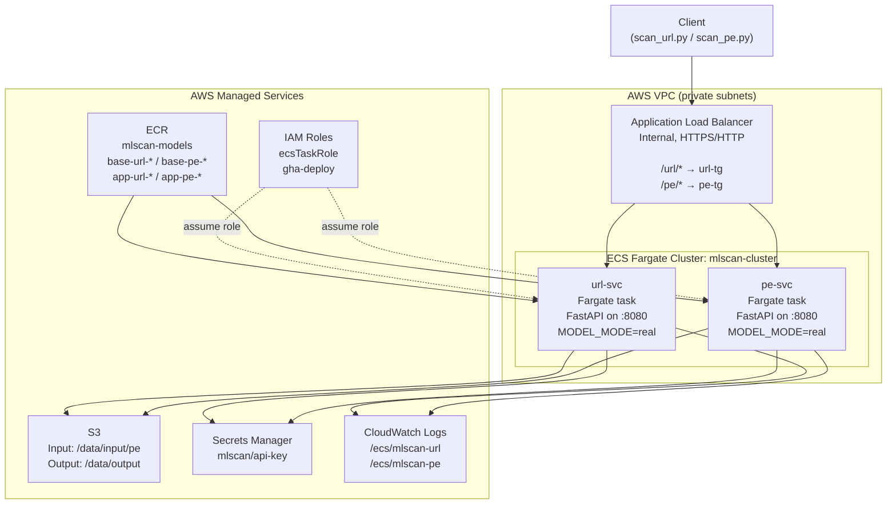

# System Architecture

## Overview

Two independent ML model inference services (URL classifier, PE classifier) run as AWS ECS Fargate tasks behind a single internal Application Load Balancer. Path-based routing directs traffic to the correct service. Both services share the same async job pattern, auth layer, and S3 output convention.

## Component Map



## Key Design Decisions

### Single ECS Cluster, Two Services
Both models run as separate ECS services on one cluster. This simplifies IAM (one task role), shared networking, and CloudWatch log groups while keeping deployments independent — a change to the PE model doesn't restart the URL service.

### Two-Layer Docker Images
```
Vendor base image (model weights + SDK) ←── NOT built in CI
    └── App image (FastAPI + our code)   ←── Built and pushed on every merge
```
Base images are pushed manually using `scripts/push_base.sh` when the vendor releases a new model version. The app image layer is thin (~10 MB) and builds in under 60 seconds in CI.

### Internal ALB, Not Public
Both services serve internal consumers only (threat intelligence pipelines, SIEM integrations). No internet gateway or public IP is assigned. Traffic stays within the VPC.

### Keyless CI/CD (OIDC)
GitHub Actions uses AWS OIDC federation. The `gha-deploy` IAM role has a trust condition scoped to the specific repository. No long-lived credentials are stored in GitHub — the workflow receives temporary STS tokens valid for the duration of the job.

## IAM Roles

| Role | Principal | Purpose |
|------|-----------|---------|
| `ecsTaskRole` | `ecs-tasks.amazonaws.com` | Allows tasks to read/write S3, read Secrets Manager, push CloudWatch logs |
| `ecsTaskExecutionRole` | `ecs-tasks.amazonaws.com` | ECS managed — allows ECR pull and log stream creation |
| `gha-deploy` | GitHub OIDC | Allows CI to push ECR images, register task definitions, update ECS services |

## Networking

| Resource | Setting |
|----------|---------|
| ALB | Internal (no public IP) |
| Subnets | Private subnets in 2 AZs |
| Security group (ALB) | Ingress 80/443 from VPC CIDR |
| Security group (ECS tasks) | Ingress 8080 from ALB security group only |
| Target group deregistration delay | 300 s (normal), 30 s (during maintenance) |

## Scaling

ECS Fargate services are configured with `desired_count = 1` by default (single container per service). To scale out:
- Adjust `desired_count` or attach Application Auto Scaling to scale on ALBRequestCountPerTarget
- The async job store is currently in-memory per container; for multi-replica deployments, replace with an external store (DynamoDB, Redis)
