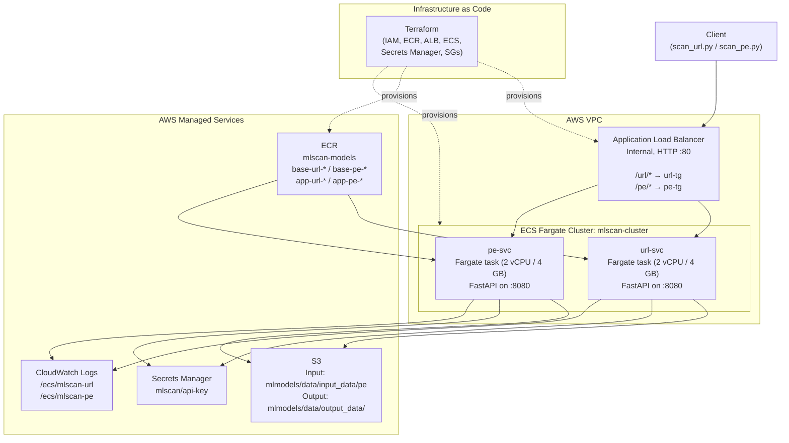

# System Architecture

## Overview

Two independent ML model inference services (URL classifier, PE file classifier) run as AWS ECS Fargate tasks behind a single internal Application Load Balancer. Path-based routing directs traffic to the correct service. All AWS infrastructure is managed by Terraform. Both services share the same async job pattern, auth layer, and S3 output convention.

## Component Map



## Key Design Decisions

### Infrastructure as Code (Terraform)
All AWS resources — IAM roles, ECR repo, Secrets Manager secret, security groups, ALB, ECS cluster, task definitions, services, and CloudWatch log groups — are defined in `terraform/`. A single `terraform apply` provisions the complete environment. Terraform state is stored in S3.

The ECS task definitions and services use `lifecycle { ignore_changes = [...] }` so Terraform doesn't revert image tags that CI has updated.

### Single ECS Cluster, Two Services
Both models run as separate ECS services on one cluster. This simplifies IAM (one task role), shared networking, and CloudWatch log groups, while keeping deployments independent — a change to the PE model doesn't restart the URL service.

### Two-Layer Docker Images
```
ML model base image (model weights + SDK) ←── pushed manually with push_base.sh
    └── App image (FastAPI + our code)   ←── built and pushed on every CI merge
```
Base images are pushed manually when a new model version is released. The app layer is thin (~10 MB) and builds in under 60 seconds in CI.

### Internal ALB, Not Public
Both services serve internal consumers only. No internet gateway or public IP is assigned to ECS tasks. Traffic stays within the VPC.

### Keyless CI/CD (OIDC)
GitHub Actions uses AWS OIDC federation. The `gha-mlscan-deploy` IAM role has a trust condition scoped to the specific repository. No long-lived credentials are stored in GitHub — the workflow receives temporary STS tokens valid for the duration of the job.

## IAM Roles

| Role | Principal | Purpose |
|------|-----------|---------|
| `mlscan-task-role` | `ecs-tasks.amazonaws.com` | Allows tasks to read/write S3, read Secrets Manager, push CloudWatch logs |
| `ecsTaskExecutionRole` | `ecs-tasks.amazonaws.com` | ECS managed — allows ECR pull and log stream creation |
| `gha-mlscan-deploy` | GitHub OIDC | Allows CI to push ECR images, register task definitions, update ECS services |

## Networking

| Resource | Setting |
|----------|---------|
| ALB | Internal (no public IP) |
| Subnets | Subnets in 2+ AZs |
| Security group (ALB) | Ingress TCP 80 from caller EC2 security group |
| Security group (ECS tasks) | Ingress TCP 8080 from ALB security group only |
| Target group deregistration delay | 300 s |

## Scaling

ECS Fargate services run `desired_count = 1` by default (single container per service). To scale out:
- Adjust `desired_count` in `terraform/ecs.tf` and run `terraform apply`
- The async job store is currently in-memory; for multi-replica deployments, replace with DynamoDB or ElastiCache
