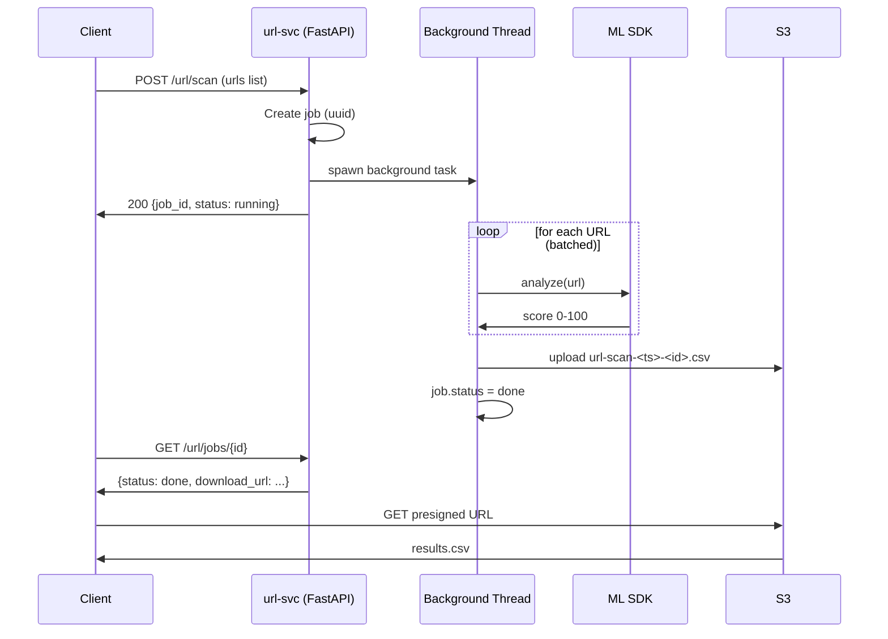
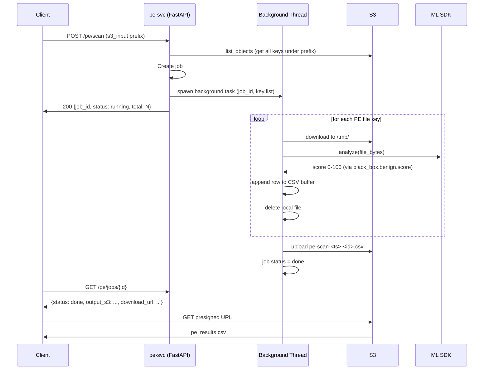

# Data Flow

## URL Classification

### Input
A list of URLs submitted in the POST request body. No files are read from S3.

```json
POST /url/scan
{"urls": ["https://example.com", "http://suspicious.net/page"]}
```

### Processing



### Output CSV

```
url,score,malicious
https://example.com,12,0
http://suspicious.net/page,67,1
```

---

## PE File Classification

### Input
An S3 prefix pointing to a directory of PE (Windows executable) binary files. Files are downloaded to a temporary local directory, scored, then deleted.

```json
POST /pe/scan
{"s3_input": "s3://<YOUR_S3_BUCKET>/data/input/pe/"}
```

### Processing



### Output CSV

```
filename,score,malicious
setup.exe,60,1
notepad.exe,6,0
calculator.dll,7,0
```

Score source in PE model report:
```
result[0].report.black_box.benign.score  →  0-100 integer
```
Higher score = more malicious. Threshold: **≥ 30 → malicious = 1**.

---

## S3 Object Layout

```
s3://<YOUR_S3_BUCKET>/
├── mlmodels/data/input_data/
│   ├── urls/         (optional: pre-loaded URL lists)
│   └── pe/           ← PE binary files scanned by pe-svc
└── mlmodels/data/output_data/
    ├── url/
    │   └── url-scan-20250301-120000-abc123.csv
    └── pe/
        └── pe-scan-20250301-120500-def456.csv
```

Output files are retained indefinitely in S3. Presigned download URLs expire after 7 days but the underlying S3 object remains. Add an S3 lifecycle rule to expire outputs after your desired retention period.

---

## Scoring Model

Both models use the same scoring convention:

| Value | Type | Range | Meaning |
|-------|------|-------|---------|
| `score` | int | 0–100 | Maliciousness probability (100 = certainly malicious) |
| `malicious` | int | 0 or 1 | 1 if score ≥ threshold (default 30) |

The `THRESHOLD` environment variable controls the cutoff and can be adjusted per deployment without rebuilding the image.

### Score Sources by Model

| Model | SDK result path |
|-------|----------------|
| URL | `result[0]["report"]["score"]` |
| PE | `result[0]["report"]["black_box"]["benign"]["score"]` |

Both are cast to `int(round(float(...)))` to normalize any floating-point representation returned by the SDK.
